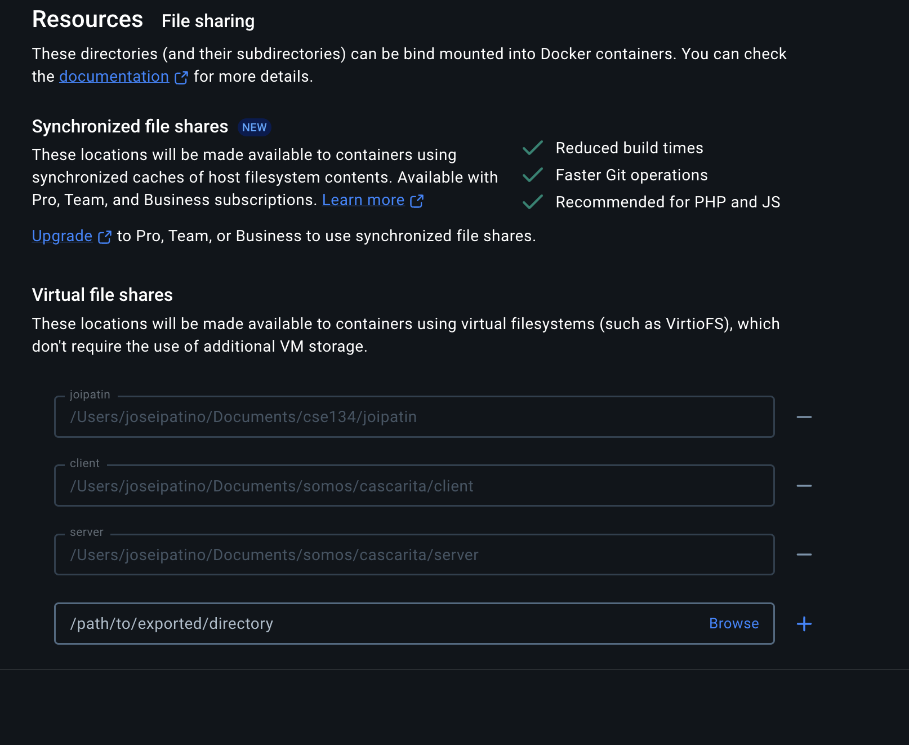

# Cascarita

Welcome to Cascarita! This file provides instructions on how to run important commands and navigate through the project.

## Prerequisites

Follow each part of pre-requisites to ensure a successful setup!

### Tools

- [Docker Desktop](https://www.docker.com/products/docker-desktop/) - used to run our client, server, and reverse proxy
- [add ssh key to your GitHub](https://docs.github.com/en/authentication/connecting-to-github-with-ssh/generating-a-new-ssh-key-and-adding-it-to-the-ssh-agent) - facilitates git version control
- [DBeaver](https://dbeaver.io/) - open source database tool
- [aws-cli](https://docs.aws.amazon.com/cli/latest/userguide/getting-started-install.html) - needed to fetch secrets to run our application

### AWS Profile

Each developer will have an AWS account needed for development. For more information, contact Armando or Luis to help you get setup!

1. [Log into your AWS account](https://us-east-2.signin.aws.amazon.com/oauth?client_id=arn%3Aaws%3Asignin%3A%3A%3Aconsole%2Fcanvas&code_challenge=0z2R5WfJWU0kBXRcGgkzic5x86c7X6AviMcdrbgZAXo&code_challenge_method=SHA-256&response_type=code&redirect_uri=https%3A%2F%2Fconsole.aws.amazon.com%2Fconsole%2Fhome%3FhashArgs%3D%2523%26isauthcode%3Dtrue%26state%3DhashArgsFromTB_us-east-2_20c637e4455ece40). The "Account ID" will be `cascarita`. The "IAM username" will be the first letter of your first name and your last name (i.e. "abanuelos"). For your first time logging in, your password will be temporary and then you will be given the option to change it!
2. [Create an AWS access key](https://docs.aws.amazon.com/IAM/latest/UserGuide/id_credentials_access-keys.html). When you go through the flow of creating the access keys you will be given two values. Save them!:

```bash
AWS_ACCESS_KEY=
AWS_SECRET_ACCESS_KEY=
```

3. Create a `.aws/credentials` and `.aws/config` file at your root directory by running the following commands:

```bash
cd ~
mkdir .aws
touch .aws/credentials
touch .aws/config
```

4. Modify the `.aws/config` file to look like the following:

```bash
[cascarita]
region=us-west-1
output=json
```

5. Modify the `.aws/credentials` file with your AWS access and secret access key:

```bash
[cascarita]
aws_access_key_id=XXXXXXXX
aws_secret_access_key=XXXXXXXXXXXXXXXXXXX
```

## Setup and Installation

We have a setup script that will:

- install necessary dependencies like `nvm`, `node`, `pnpm`, `mysql`, etc.
- pull environment variables from AWS Secrets Manager
- build and run Docker containers

```bash
make setup
```

After this is finished make sure to stop any local `mysql` processes with:

```bash
brew services stop mysql
```

## Docker Permissions

In order for us to have hot-reloads for frontend and backend changes with our docker containers, you need to grant Docker Desktop the following permissions by going to `Docker Settings -> Resources -> File Sharing` and add the paths to your `client` and `server` directories.



## Other commands

- `make database` to run the latest migrations
- `make restart` will restart the containers for effects to take effect
- `make build` to build new containers as needed
- `make test` will run backend related tests using jest

### License

Copyright (c) 2025 Cascarita.io

Permission is hereby granted, free of charge, to any person obtaining a copy of this software and associated documentation files (the "Software"), to use the Software for personal or academic purposes only, subject to the following conditions:

1. **Non-Commercial Use Only**:
   The Software may not be used, copied, modified, merged, published, distributed, sublicensed, or sold for commercial purposes or financial gain.

2. **No Redistribution for Sale**:
   The Software and its derivatives may not be sold, sublicensed, or otherwise distributed in exchange for any monetary or non-monetary compensation.

3. **Ownership**:
   The copyright holders retain all ownership and intellectual property rights of the Software. Any unauthorized use, duplication, or modification of the Software that violates this license will constitute a breach of copyright.

4. **Attribution**:
   The above copyright notice and this license must be included in all copies or substantial portions of the Software.

5. **Warranty Disclaimer**:
   THE SOFTWARE IS PROVIDED "AS IS", WITHOUT WARRANTY OF ANY KIND, EXPRESS OR IMPLIED, INCLUDING BUT NOT LIMITED TO THE WARRANTIES OF MERCHANTABILITY, FITNESS FOR A PARTICULAR PURPOSE, AND NONINFRINGEMENT. IN NO EVENT SHALL THE AUTHORS OR COPYRIGHT HOLDERS BE LIABLE FOR ANY CLAIM, DAMAGES, OR OTHER LIABILITY, WHETHER IN AN ACTION OF CONTRACT, TORT, OR OTHERWISE, ARISING FROM, OUT OF, OR IN CONNECTION WITH THE SOFTWARE OR THE USE OR OTHER DEALINGS IN THE SOFTWARE.

By using this Software, you agree to the terms and conditions stated herein. If you do not agree, you may not use, modify, or distribute this Software.
